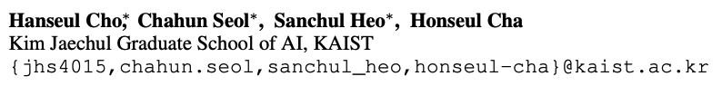
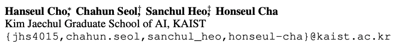

<!-- markdownlint-disable MD033 -->

## TL;DR

📌 **Use the command** `\rlap{$^*$}` when you list multiple equally contributed authors' names, separated by commas (e.g., ICLR template). For example:

```latex
[1stAuthor1]\thanks{Equal Contribution.},~~[1stAuthor2]\rlap{$^*$},~~[1stAuthor3]\rlap{$^*$},~~[2ndAuthor],...
```

---

## What's the Problem?

I'd like to share a visually appealing LaTeX trick(?) for listing multiple co-first authors that I recently figured out.

Let me introduce three of my "colleagues" (graduate students from KAIST AI) who will assist me in this document: meet *Chahun Seol*, *Sanchul Heo*, and *Honseul Cha*!
Of course, they are all imaginary characters I created. (You may notice these names are all *anagrams* of my name, *Hanseul Cho*.)
But in this document, they and I will **play the role** of co-authors of a brilliant paper submitted to ICLR 2026, preparing together for a camera-ready version of our manuscript. 😎
(Please don't get me wrong; I don't want to advertise an imaginary paper that I haven't actually taken part in!)

You're probably familiar with the command `\thanks{...}` for indicating equal contributions, affiliations, or side information about specific authors.
But how should *we* mark the same footnote symbol (e,g. asterisk(`*`), ...) to mutiple author names among us (e.g., co-first authors)?

For example, one of the simplest line of code would be ...

```latex
\author{
% Please be aware that the default template for ICLR main conference papers recommends us putting commas to delimit the author names.
Hanseul Cho\thanks{Equal Contribution.},~~Chahun Seol$^*$,~~Sanchul Heo$^*$,~~Honseul Cha \\ % author names
Kim Jaechul Graduate School of AI, KAIST \\ % affiliation
\texttt{\{jhs4015,chahun.seol,sanchul\_heo,honseul-cha\}@kaist.ac.kr} \\ % e-mail addresses
\And
...[More CoAuthors]...
}
```

It seems good... or does it? When we actually compile this, we get the following:



Do you notice anything weird? Yes, the gap between the asterisk and the comma!

* The command `\thanks{...},` somehow reduces the gap between the footnote mark and the comma, so that the compiled result shows the comma right after the last letter of an author name; 🙂
* The command `$^*$`, however, is just a letter (in math mode of LaTeX)! It has no additional function to shrink the gap between the commas and the author names. 👿

What should we do to match the lengths of the gaps? 🤔

## Common Failure(?) Cases

👺 **Failure 1:** If the command `\thanks` is the only answer, how about using the same command several times?:

```latex
...
Hanseul Cho\thanks{Equal Contribution.},~~Chahun Seol\thanks{Equal Contribution.},~~Sanchul Heo\thanks{Equal Contribution.},~~Honseul Cha \\ % author names
...
```

The compiled result:



Obviously, this isn't the right way...😫 it applies distinct footnote marks for all co-author names (attached with `\thanks`).

...

👺 **Failure 2:** How about manually adjusting the horizontal spaces?

```latex
...
Hanseul Cho\thanks{Equal Contribution.},~~Chahun Seol$^*$\hspace{-1.6mm},~~Sanchul Heo$^*$\hspace{-1.6mm},~~Honseul Cha \\ % author names
...
```

The compiled result:


Okay, now it seems (almost) perfect, at least visually!
However, I don't want to do it this way: the size of shrinkage (e.g., `-1.6mm` above) needs to be determined carefully through multiple compilations.
Not only is it not elegant, but it's also practically undesirable, especially when your entire LaTeX project is so heavy...

## The Solution That I've Found

To figure out an elegant & practical solution, I probed the ICLR template style file (`iclr2026_conference.sty`), with the keyword 'thanks'.
And I found the following code lines...

```latex
\def\maketitle{\par
\begingroup
   \def\thefootnote{\fnsymbol{footnote}}
   \def\@makefnmark{\hbox to 0pt{$^{\@thefnmark}$\hss}} % for perfect author
                                                        % name centering
%   The footnote-mark was overlapping the footnote-text,
%   added the following to fix this problem               (MK)
   \long\def\@makefntext##1{\parindent 1em\noindent
                            \hbox to1.8em{\hss $\m@th ^{\@thefnmark}$}##1}
   \@maketitle \@thanks
\endgroup
\setcounter{footnote}{0}
\let\maketitle\relax \let\@maketitle\relax
\gdef\@thanks{}\gdef\@author{}\gdef\@title{}\let\thanks\relax}
```

Can you guess how the command `\thanks` is redefined?
I'm not an expert on LaTeX, but I somehow realized that the fourth line above (`\def\@makefnmark{\hbox to 0pt{$^{\@thefnmark}$\hss}}`) is sort of an important part, which seems to put the footnote mark behind the author name!
But what is `\hss`?

I asked Google Search for help (side note: I "still" prefer to find solutions for debugging my code without using LLM, although I'm a PhD student studying AI...).
The Google Search told me: SEE THIS POST ON [STACKEXCHANGE ("What are the \hbox \hss \hskip commands?")](https://tex.stackexchange.com/questions/605490/what-are-the-hbox-hss-hskip-commands).
ROGER THAT.

It basically tells us:

* `\hbox to <WIDTH>{<SOMETHING>}` puts `<SOMETHING>` inside a horizontal box of width `<WIDTH>`.
* You can adjust the alignment within the box using `\hss` inside `<SOMETHING>`.
  * If `<SOMETHING>` is `\hss <STUFF>\hss`, it aligns `<STUFF>` at the center.
  * Also, `\hss <STUFF>` corresponds to the right alignment of `<STUFF>`.
  * Similarly, `<STUFF>\hss` corresponds to the left alignment of `<STUFF>`.
* For the cases where `<WIDTH>` equals `0pt`, TeX introduces their shorthand commands: `clap`, `llap`, and `rlap`.
  * `\hbox to 0pt{\hss <STUFF>\hss}` == `\clap{<STUFF>}`.
  * `\hbox to 0pt{\hss <STUFF>}` == `\llap{<STUFF>}`: the right end of `<STUFF>` comes to center, so the text `<STUFF>` goes **left** of the center.
  * `\hbox to 0pt{<STUFF>\hss}` == `\rlap{<STUFF>}`: the left end of `<STUFF>` comes to center, so the text `<STUFF>` goes **right** of the center.

So, my conjecture is: Since the style file contains `\hbox to 0pt{$^{\@thefnmark}$\hss}`, if `\@thefnmark` is substituted with the asterisk(`*`), then it must be equivalent to `\rlap{$^*$}`!

Therefore, my FINAL TRIAL is as follows:

```latex
...
Hanseul Cho\thanks{Equal Contribution.},~~Chahun Seol\rlap{$^*$},~~Sanchul Heo\rlap{$^*$},~~Honseul Cha \\ % author names
...
```

And the compiled result is...


TADA! An elegant code (without laborious decision of numerics) and visually satisfying result! 🎉

## Conclusion

I hope this document help some researchers who are still novice in LaTeX writing (like me).
Lastly, say goodbye to my awesome "colleagues", *Chahun Seol*, *Sanchul Heo*, and *Honseul Cha*! 👋
