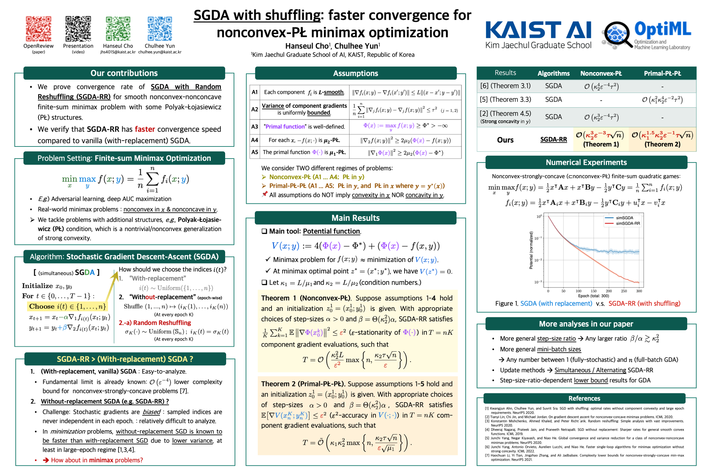

## Abstract

Stochastic gradient descent-ascent (SGDA) is one of the main workhorses for solving finite-sum minimax optimization problems. Most practical implementations of SGDA randomly reshuffle components and sequentially use them (i.e., without-replacement sampling); however, there are few theoretical results on this approach for minimax algorithms, especially outside the easier-to-analyze (strongly-)monotone setups. To narrow this gap, we study the convergence bounds of SGDA with random reshuffling (SGDA-RR) for smooth nonconvex-nonconcave objectives with Polyak-{\L}ojasiewicz (P{\L}) geometry. We analyze both simultaneous and alternating SGDA-RR for nonconvex-P{\L} and primal-P{\L}-P{\L} objectives, and obtain convergence rates faster than with-replacement SGDA. Our rates extend to mini-batch SGDA-RR, recovering known rates for full-batch gradient descent-ascent (GDA). Lastly, we present a comprehensive lower bound for GDA with an arbitrary step-size ratio, which matches the full-batch upper bound for the primal-P{\L}-P{\L} case.

## Keywords

Stochastic gradient descent-ascent(SGDA), without-replacement sampling, Random reshuffling (RR), SGDA-RR, finite-sum optimization, minimax optimization, nonconvex-PŁ, primal-PŁ-PŁ, convergence analysis

<iframe src="https://www.slideshare.net/slideshow/embed_code/key/4Cis8oNxKBvoq3" width="960" height="540" frameborder="0" marginwidth="0" marginheight="0" scrolling="no" style="border:1px solid #CCC; border-width:1px; margin-bottom:5px; max-width: 100%;" allowfullscreen> </iframe> 
 

