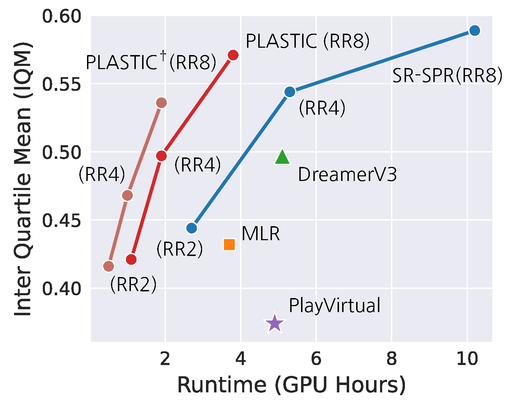
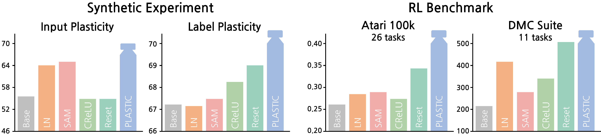
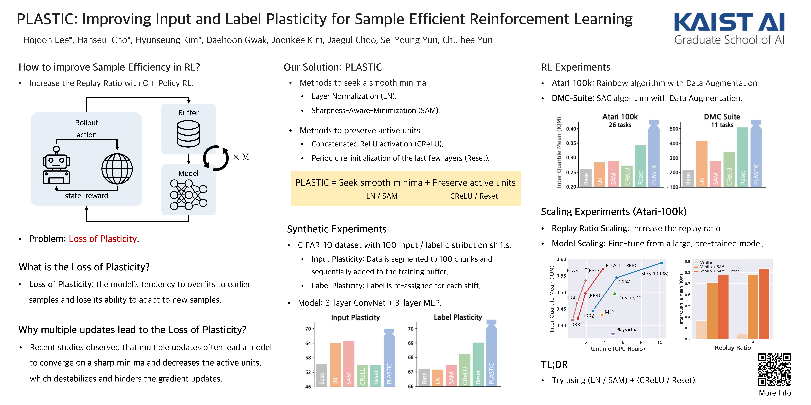

## Main Figures

  

## Abstract

In Reinforcement Learning (RL), enhancing sample efficiency is crucial, particularly in scenarios when data acquisition is costly and risky.
In principle, off-policy RL algorithms can improve sample efficiency by allowing multiple updates per environment interaction.
However, these multiple updates often lead the model to overfit to earlier interactions, which is referred to as the *loss of plasticity*.
Our study investigates the underlying causes of this phenomenon by dividing plasticity into two aspects. *Input plasticity*, which denotes the model's adaptability to changing input data, and *label plasticity*, which denotes the model's adaptability to evolving input-output relationships.
Synthetic experiments on the CIFAR-10 dataset reveal that finding smoother minima of loss landscape enhances input plasticity, whereas refined gradient propagation improves label plasticity.
Leveraging these findings, we introduce the **PLASTIC** algorithm which harmoniously combines techniques to address both concerns.
With minimal architectural modifications, PLASTIC achieves competitive performance on benchmarks including Atari-100k and Deepmind Control Suite.
This result emphasizes the importance of preserving the model's plasticity to elevate the sample efficiency in RL.
The code is available at [https://github.com/dojeon-ai/plastic](https://github.com/dojeon-ai/plastic).

## Keywords

Reinforcement Learning, Plasticity, Sharpness-aware Minimization, Reset mechanism

## Poster

## Slide

<iframe src="https://www.slideshare.net/slideshow/embed_code/key/ee0qzvaq7Y7jeU" width="960" height="540" frameborder="0" marginwidth="0" marginheight="0" scrolling="no" style="border:1px solid #CCC; border-width:1px; margin-bottom:5px; max-width: 100%;" allowfullscreen> </iframe> 
 

