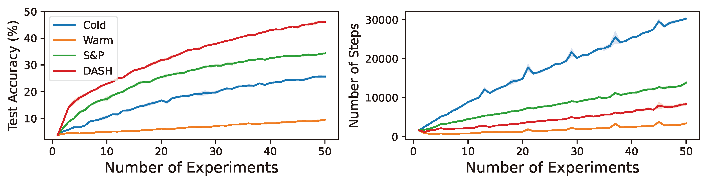
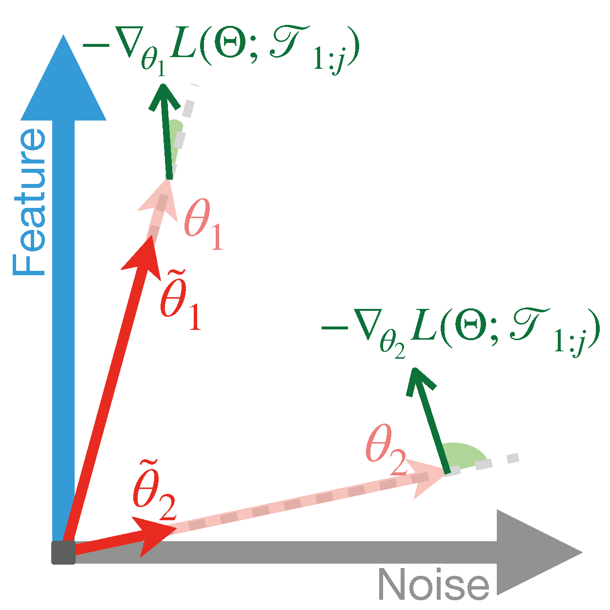

## Abstract

Warm-starting neural networks by initializing them with previously learned weights is appealing, as practical neural networks are often deployed under a continuous influx of new data. However, this often leads to a phenomenon known as loss of plasticity, where the network loses its ability to learn new information and thereby shows worse generalization performance than those trained from scratch. While this issue has been actively studied in non-stationary data distributions (e.g., in reinforcement learning), it surprisingly occurs even when the data distribution remains stationary, and its underlying mechanism is poorly understood. To address this gap, we develop a learning framework that emulates real-world neural network training scenarios. Under this framework, we identify noise memorization as the primary cause of the loss of plasticity when warm-starting the neural networks in stationary data distributions. Motivated by this discovery, we propose an effective method called Direction-Aware SHrinking (DASH) to mitigate the loss of plasticity. DASH aims to selectively forget previously memorized noise while aiming to preserve learned features, based on the loss gradient computed from newly introduced data. We validate our approach in vision tasks using diverse datasets, models, and optimizers, demonstrating consistent improvements in test accuracy and training efficiency.

