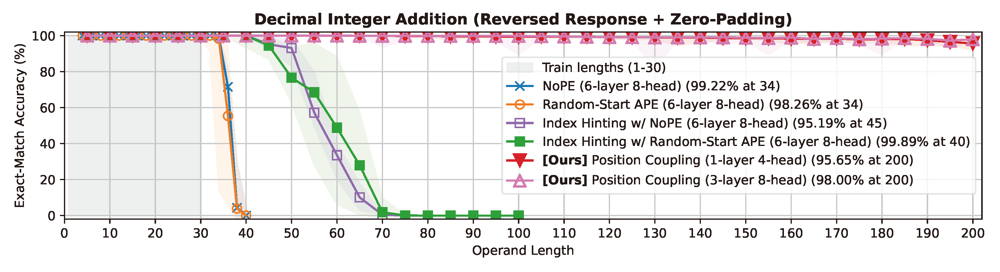

## Main Figures

  

  

## Abstract

Even for simple arithmetic tasks like integer addition, it is challenging for Transformers to generalize to longer sequences than those encountered during training. To tackle this problem, we propose position coupling, a simple yet effective method that directly embeds the structure of the tasks into the positional encoding of a (decoder-only) Transformer. Taking a departure from the vanilla absolute position mechanism assigning unique position IDs to each of the tokens, we assign the same position IDs to two or more "relevant" tokens; for integer addition tasks, we regard digits of the same significance as in the same position. On the empirical side, we show that with the proposed position coupling, our models trained on 1 to 30-digit additions can generalize up to 200-digit additions (6.67x of the trained length). On the theoretical side, we prove that a 1-layer Transformer with coupled positions can solve the addition task involving exponentially many digits, whereas any 1-layer Transformer without positional information cannot entirely solve it. We also demonstrate that position coupling can be applied to other algorithmic tasks such as Nx2 multiplication and a two-dimensional task. Our code is available at [github.com/HanseulJo/position-coupling](https://github.com/HanseulJo/position-coupling).

## Poster

## Slide

<iframe src="https://www.slideshare.net/slideshow/embed_code/key/iNEl39UaLR9HAF" width="960" height="540" frameborder="0" marginwidth="0" marginheight="0" scrolling="no" style="border:1px solid #CCC; border-width:1px; margin-bottom:5px; max-width: 100%;" allowfullscreen> </iframe> 
 

