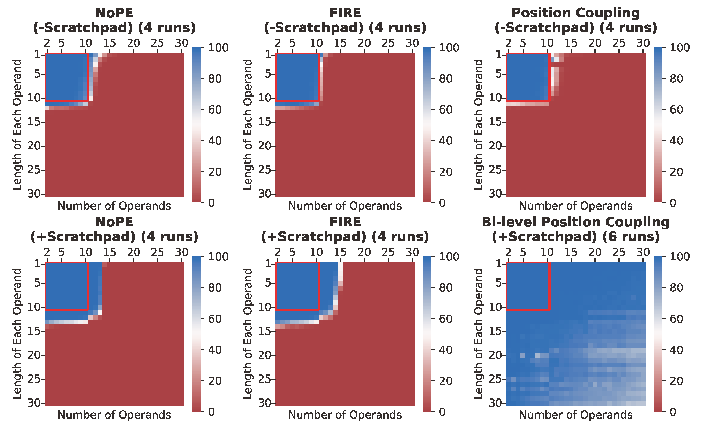

  
## Abstract

Transformers often struggle with length generalization, meaning they fail to generalize to sequences longer than those encountered during training. While arithmetic tasks are commonly used to study length generalization, certain tasks are considered notoriously difficult, e.g., multi-operand addition (requiring generalization over both the number of operands and their lengths) and multiplication (requiring generalization over both operand lengths). In this work, we achieve approximately 2–3× length generalization on both tasks, which is the first such achievement in arithmetic Transformers. We design task-specific scratchpads enabling the model to focus on a fixed number of tokens per each next-token prediction step, and apply multi-level versions of Position Coupling ([Cho et al., 2024](https://arxiv.org/abs/2405.20671); [McLeish et al., 2024](https://arxiv.org/abs/2405.17399)) to let Transformers know the right position to attend to. On the theory side, we prove that a 1-layer Transformer using our method can solve multi-operand addition, up to operand length and operand count that are exponential in embedding dimension. All our experiments are reproducible based on the codebase in [github.com/HanseulJo/position-coupling](https://github.com/HanseulJo/position-coupling).
